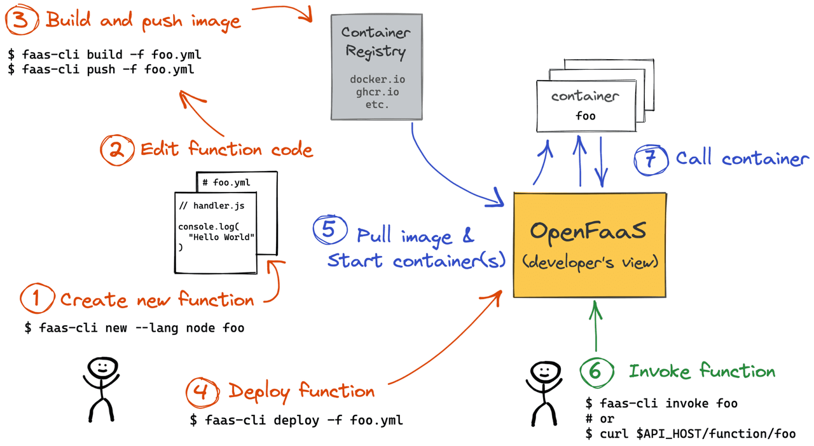
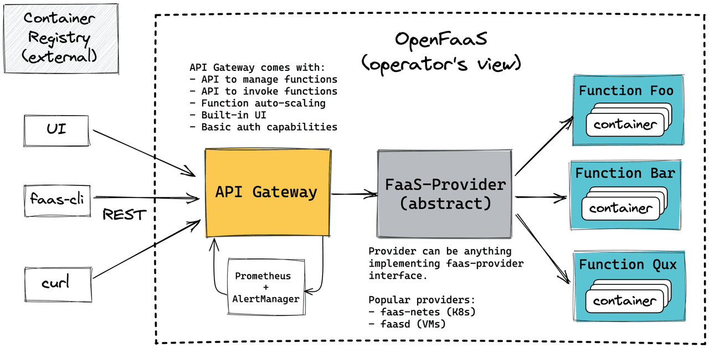
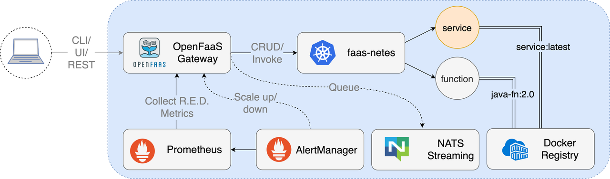
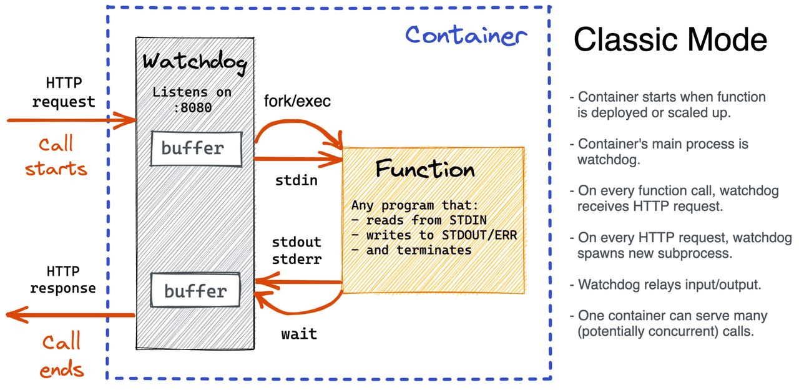
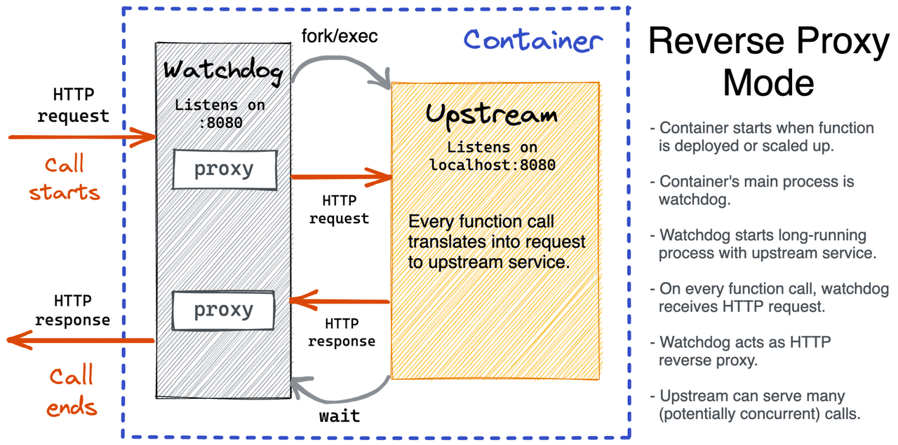

# 介绍
OpenFaaS是一个开源的函数计算平台，旨在简化开发者在云原生环境中构建和部署无服务器函数。它基于Docker和Kubernetes，提供了一个灵活且可扩展的架构，使开发者能够轻松地将事件驱动的函数和微服务部署到Kubernetes集群中。

# 如何使用
首先需要部署，此步省略，直接看已经部署好的实例。
开发人员工作流程：


## 看一个具体的案例

### 首先发布一个go函数
先创建一个函数say，这一步将创建一个函数的stack file和对应的目录
``` shell
root@hcss-ecs-1326:~# faas-cli new --lang go say
Folder: say created.
  ___                   _____           ____
 / _ \ _ __   ___ _ __ |  ___|_ _  __ _/ ___|
| | | | '_ \ / _ \ '_ \| |_ / _` |/ _` \___ \
| |_| | |_) |  __/ | | |  _| (_| | (_| |___) |
 \___/| .__/ \___|_| |_|_|  \__,_|\__,_|____/
      |_|


Function created in folder: say
Stack file written: say.yml

Notes:
Warning: this classic Go template has been DEPRECATED and
is being maintained for backwards compatibility reasons only.

Use the golang-middleware template instead, learn more at:

See more: https://docs.openfaas.com/cli/templates

root@hcss-ecs-1326:~# ls -l say*
-rw------- 1 root root  146 Jan 23 20:25 say.yml

say:
total 8
-rw-r--r-- 1 root root  33 Jan 23 20:25 go.mod
-rw-r--r-- 1 root root 163 Jan 23 20:25 handler.go

```
handler.go
```go
// Handle a serverless request
func Handle(req []byte) string {
	return fmt.Sprintf("Hello, Go. You said: %s", string(req))
}
```

然后build and deploy
```shell
root@hcss-ecs-1326:~# faas-cli build -f say.yml
root@hcss-ecs-1326:~# faas-cli push -f say.yml
root@hcss-ecs-1326:~# faas-cli deploy -f say.yml
```
上述步骤完成之后，就可以调用啦
```shell
root@hcss-ecs-1326:~# curl -X GET -d 'hello' http://110.41.38.165:31112/function/say
Hello, Go. You said: hello
```


# 了解下架构


## API Gateway
- 提供管理函数的API
- 提供调用函数的API
- 内置了一个简单的管理函数的UI
- 提供自动伸缩的API，由alert manager触发
- 基础的鉴权能力等
## FaaS-Provider
主流的FaaS Provider实现有两种：
- faasd：用于部署在虚拟机上的轻量级实现
- faas-netes：基于k8s的provider实现
FaaS Provider定义了一套抽象的接口，提供方主要需要实现以下的几种能力：
- 函数的CRUD
- 函数的调用
- 函数的缩放

# 部署的openfaas包含了哪些服务
```bash
root@hcss-ecs-1326:~# kubectl get pods -n openfaas
NAME                            READY   STATUS    RESTARTS       AGE
alertmanager-795bbdc56c-vlqt2   1/1     Running   2 (35d ago)    40d
gateway-67df8c4d4-ffrmz         2/2     Running   11 (35d ago)   40d
nats-5c48bc8b46-z2h6x           1/1     Running   2 (35d ago)    40d
prometheus-78d4c9f748-6hcrh     1/1     Running   2 (35d ago)    40d
queue-worker-b9965cc56-lw7hm    1/1     Running   4 (35d ago)    40d
```
好像没有faas-netes，不过gateway这个pod是包含了2个容器的，查看一下会发现faas-netes在这里。
```bash
root@hcss-ecs-1326:~# kubectl describe pod gateway-67df8c4d4-ffrmz -n openfaas
Name:         gateway-67df8c4d4-ffrmz
Namespace:    openfaas
...
Controlled By:  ReplicaSet/gateway-67df8c4d4
Containers:
  gateway:
    ...
  faas-netes:
    ...
```

# 工作流

开发者可基于CLI、REST API、以及内置的UI调用函数。 Gateway接收到请求之后，如果是同步请求则转发给faas-netes（provider），faas-netes再调用具体的函数，在k8s中通常就是service。 如果是异步请求，将request入队，后续由queue-worker进行消费，可以在请求头中加上X-Callback-Url来接收异步调用的回调信息。 Prometheus从Gateway中采集数据，然后alert manager基于这些数据来触发Gateway进行scale up/down。

# 部署的具体是个什么
看看build之后的产物
```shell
root@hcss-ecs-1326:~/build/say# tree .
.
├── Dockerfile
├── function
│   ├── go.mod
│   └── handler.go
├── go.mod
├── go.work
├── main.go
└── template.yml
```
其中function目录下是执行`faas-cli new --lang go say`时自动生成的代码。
main.go
```go
func main() {
	input, err := ioutil.ReadAll(os.Stdin)
	if err != nil {
		log.Fatalf("Unable to read standard input: %s", err.Error())
	}

	fmt.Println(function.Handle(input))
}
```
从标准输入中读取内容，然后交给handle处理，将返回值打印到标准输出。上面我们介绍了在k8s中函数是以service的形式提供能力，那如何将这样一个程序部署为service呢？我们看看Dockerfile
```dockerfile
FROM --platform=${TARGETPLATFORM:-linux/amd64} ghcr.io/openfaas/classic-watchdog:0.2.3 as watchdog
FROM --platform=${BUILDPLATFORM:-linux/amd64} golang:1.20-alpine3.18 as build

...

COPY --from=watchdog /fwatchdog /usr/bin/fwatchdog
RUN chmod +x /usr/bin/fwatchdog

WORKDIR /go/src/handler/function
RUN mkdir -p /go/src/handler/function/static

RUN GOOS=${TARGETOS} GOARCH=${TARGETARCH} CGO_ENABLED=${CGO_ENABLED} go test ./... -cover

WORKDIR /go/src/handler

RUN GOOS=${TARGETOS} GOARCH=${TARGETARCH} CGO_ENABLED=${CGO_ENABLED} \
    go build --ldflags "-s -w" -o handler .

FROM --platform=${TARGETPLATFORM:-linux/amd64} alpine:3.18.2 as ship

RUN apk --no-cache add ca-certificates \
    && addgroup -S app && adduser -S -g app app

WORKDIR /home/app

COPY --from=build --chown=app /usr/bin/fwatchdog                  .
COPY --from=build --chown=app /go/src/handler/handler             .
COPY --from=build --chown=app /go/src/handler/function/static   static

USER app

ENV fprocess="./handler"
EXPOSE 8080

HEALTHCHECK --interval=3s CMD [ -e /tmp/.lock ] || exit 1

CMD ["./fwatchdog"]
```
可以看到容器启动的是fwatchdog进程。那fwatchdog做了哪些事情呢？其实简单想想，大体也能猜到。

# WatchDog
WatchDog是容器内的常驻进程，作为函数的entry point，接收来自外部的HTTP请求，然后将请求转换为标准输入，启动函数对应的进程执行，然后将标准输出作为请求对应的响应发送给调用方。这就是classic watchdog的工作流程。

## classic watchdog

这种模式类似于CGI，很方便，任意的接收标准输入的程序都可以简单的部署。但也有缺陷，主要体现在无法复用资源，例如缓存、数据库连接等。还有进程启动慢导致响应慢等问题。
于是类似于FastCGI，官方又提供了of-watchdog

## of-watchdog

此模式下，函数是以http服务的形式启动并常驻，仅创建一次函数进程，然后作为watchdog的上游服务器提供服务。

这种模式性能更优，更适合流式的应用场景。

Ref:

https://docs.openfaas.com/architecture/gateway/

https://github.com/openfaas/faas

https://atbug.com/openfaas-case-study-zh/

